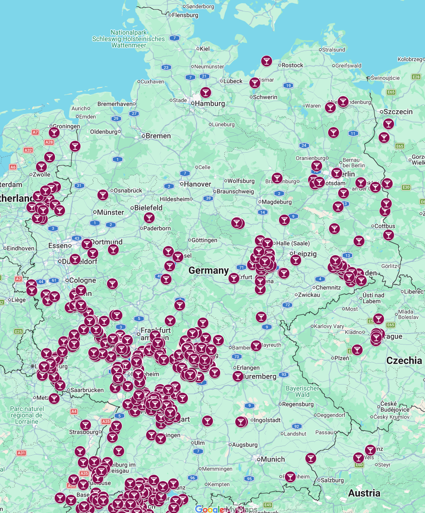

# vineyard-crawler

Scrapes named German vineyard sites (Weinlagen / Einzellagen) from OpenStreetMap via the
[Overpass API](https://overpass-api.de/) and exports them to CSV.



For each vineyard the crawler emits:

| Field             | Description                                                              |
| ----------------- | ------------------------------------------------------------------------ |
| `name`            | OSM `name` tag                                                           |
| `osm_type`        | `way` or `relation`                                                      |
| `osm_id`          | OSM element id                                                           |
| `latitude`        | Centroid latitude (decimal degrees)                                      |
| `longitude`       | Centroid longitude (decimal degrees)                                     |
| `area_ha`         | Approximate polygon area in hectares (Haversine / spherical-excess)      |
| `grape_variety`   | OSM `grape_variety` tag (optional)                                       |
| `wikipedia`       | OSM `wikipedia` tag (optional)                                           |
| `wikidata`        | OSM `wikidata` tag (optional)                                            |
| `operator`        | Managing winery or estate (optional)                                     |
| `website`         | Winery website; merged from `website` and `contact:website` (optional)  |
| `locality`        | Official VDP locality / Ortslage name (optional)                         |
| `classification`  | VDP classification e.g. `vdp_grosse_lage` (optional)                    |
| `nearest_river`   | Name of the closest OSM river (optional, requires `--waterway`)          |
| `river_distance_m`| Distance in metres to the nearest river boundary point (optional)        |

## Quick start

```bash
make init      # create venv + install all dependencies (from pyproject.toml)
make test      # run the test suite
make start     # crawl Germany and write vineyards.csv
make docs      # regenerate CLI.md from the live argument parser
```

## CLI

```bash
python main.py --output vineyards.csv \
               --bbox 47,6,55,15 \
               --timeout 180 \
               --endpoint https://overpass-api.de/api/interpreter \
               --waterway river
```

All arguments have sensible defaults; running `python main.py` with no flags
fetches Germany, enriches with river distances, and writes `vineyards.csv`.
Pass `--waterway` with no value to skip river enrichment.

See [CLI.md](CLI.md) for the full argument reference.

## OSM / Overpass policy

The crawler honours the [Overpass API usage policy](https://dev.overpass-api.de/overpass-doc/en/preface/commons.html):

- A descriptive `User-Agent` identifies the client.
- The vineyard and waterway queries run **in parallel**, each occupying one of the two concurrent slots the API grants per IP.
- `out geom` returns geometry inline — no second-pass node lookups.
- HTTP 429 (slot queue full) and 504 (server overload) are retried with exponential backoff (5 s → 10 s → 20 s).

## Visualising with Google My Maps

[Google My Maps](https://mymaps.google.com) can import the CSV directly and
plot each vineyard as a pin on an interactive map.

1. Run the crawler to produce `vineyards.csv`:

   ```bash
   make start
   ```

2. Open [mymaps.google.com](https://mymaps.google.com) and click **Create a new map**.
3. Click **Add layer**, then **Import** in the new layer's panel.
4. Upload `vineyards.csv`.
5. When prompted to choose location columns, select **`latitude`** and **`longitude`**.
6. When prompted for a title column, choose **`name`**.
7. Click **Finish** — all ~1,334 vineyards appear as pins on the map.
